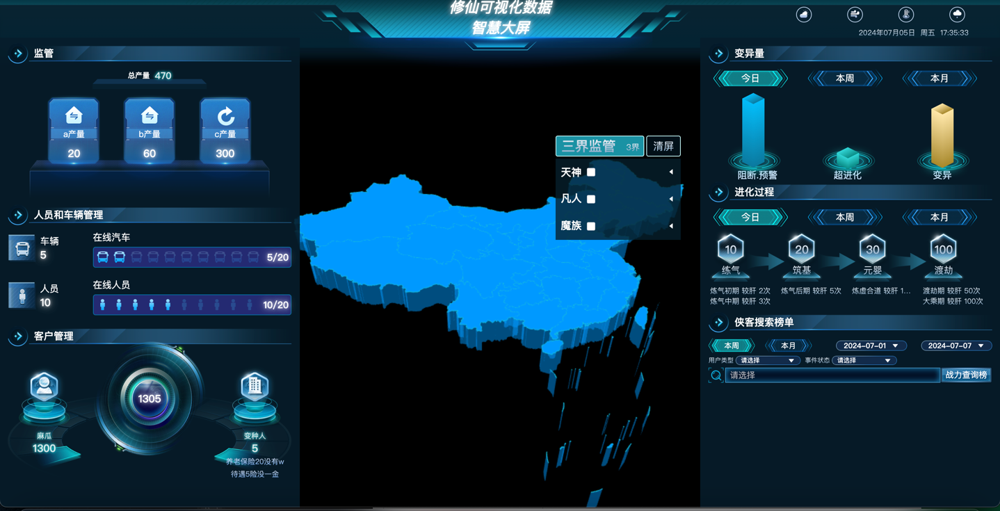

Look at the [Nuxt 3 documentation](https://nuxt.com/docs/getting-started/introduction) to learn more.

## Setup

nuxt3大屏项目开源模板；
postcss & autoprefixer px转vw实现响应式布局
集成three.js 3d地图；高德AMap地图；openlayers地图
$fetch请求方法的封装
lottie动画 & autoAnimate & d3 & three.js


```
**安装依赖
yarn && yarn prepare

运行
yarn dev

```


## Development Server

Start the development server on `http://localhost:3666`:

```bash

**配置.husky
运行命令npx husky add .husky/pre-commit "yarn lint"

```

## Production

Build the application for production:

```bash

yarn build

```

Locally preview production build:

```bash

yarn preview

```
点击在线访问：
https://lazyddui.github.io/SiHuoScreen/god/

以下下是运行效果图:



jenkins下打包部署（使用pm2进行前端项目管理）

作者：四火
联系方式(qq):2313424489

Check out the [deployment documentation](https://nuxt.com/docs/getting-started/deployment) for more information.
